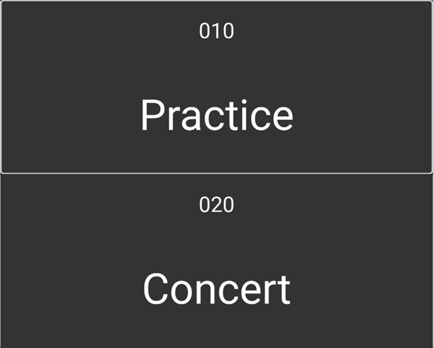
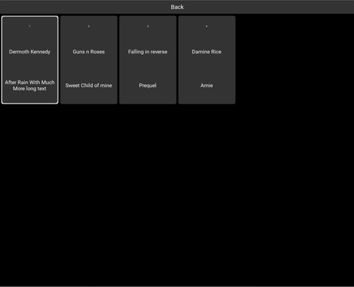
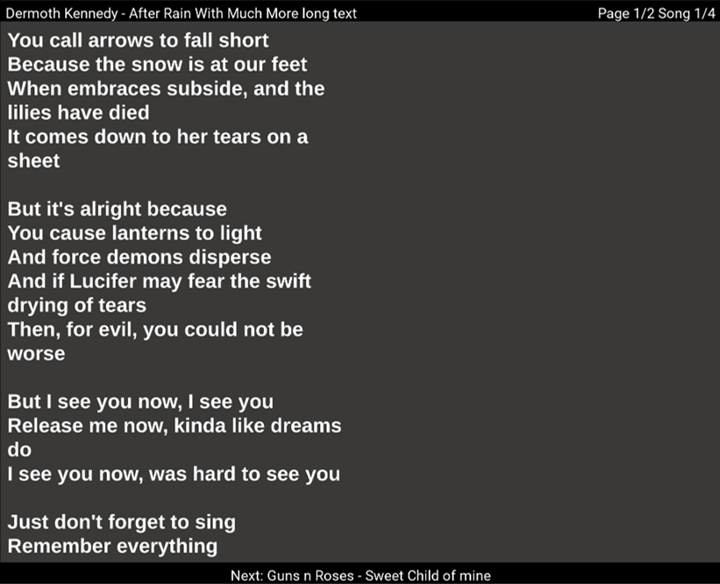

# Teleprompter App

For all performers that need a bit of a memory help on stage. This was developed to be used with a screen placed on the floor
of the stage, ideally in some sort of case that looks like a stage wedge. Songs should be given as presentations inside a folder that collects songs for a given performance ***(Songbook)***. This folder should be in a folder called `songbooks` that is located in the same folder that contains this code.

## Screenshots


<figure>
    
    <figcaption>Home Page with 2 songbooks</figcaption>
</figure>

<figure>
    
    <figcaption>A Songbook with 4 songs</figcaption>
</figure>

<figure>
    
    <figcaption>A song with song name, number of pages and total number of songs at the top. The next song is displyed at the bottom</figcaption>
</figure>

## How to navigate

To be used with a 3 button footswitch or alternatively with the 1, 2, 3 buttons on a keyboard or numpad.
Use left, right or 1, 3 to navigate. Middle and 2 are to enter a songbook or song and if inside a song it will go back to the songbook.

## Prepare songbooks

Create folder called `songbooks`. Each folder inside that will be a songbook. Folder name needs to be `<sequence> - <name>`. Inisde of these folders put presentations (currently only pptx format). The slides will be converted into images and shown in the prompter. Ideally the slides have the same size as the monitor that is to be used. Naming of the presentation files should be `<sequence> - <artist> - <song>.pptx`. 
On startup all files will be converted. Already converted files will be re-used except if the presentation modification date is newer.

The application will first look for this folder in the same folder where the app code is or if not found inside the app folder itself.
i.e
```bash
# Next to app folder
root
   telepromter_app_folder
   songbooks
or
# Inside app folder
root
    telepromter_app_folder
        songbooks
```
The first option is easier to mamage if you have your songbooks for example in another git repository.

## How to install

- `sudo apt install python3-dev libmtdev-dev libreoffice poppler-utils`
- Clone this repository and change into the directory
- Create a virtual environment using `python3 -m venv .venv`
- Activate the environment with `source .venv/bin/activate`
- `pip install kivy evdev python-pptx pdf2image`
- `sudo usermod -aG input $USER` (input reading needs sudo access or the user needs to be in the `input` group. I am not sure this is needed. I need to test with a clean setup)
- Run the actual app using `python3 main.py` if the virtual environment is active or use `<path_to_app>/.venv/bin/python <path_to_app>/main.py

## Investigating my Foot Switch

If in WSL2 follow this to get your USB device visible in Linux: https://learn.microsoft.com/en-us/windows/wsl/connect-usb.

I got the name of my footswitch using `sudo evtest`. In my case the actual `PCsensor FootSwitch Keyboard` was the one I used. If yours is called differently. Set a discriminating string in the `main.py` file for the `FOOT_SWITCH_DEVICE_NAME_SUFFIX` variable. The app will use the device that ends with the given string.

For example I had:

```
Bus 001 Device 004: ID 3553:b001 PCsensor FootSwitch

/dev/input/event7:      PCsensor FootSwitch Keyboard
/dev/input/event8:      PCsensor FootSwitch Mouse
/dev/input/event9:      PCsensor FootSwitch
```

### Finding events fired by my footswitch

Using the python `evdev` module I found:

```bash
# device.path device.name device.phys
/dev/input/event9 PCsensor FootSwitch usb-0000:01:00.0-1.2/input1
/dev/input/event8 PCsensor FootSwitch Mouse usb-0000:01:00.0-1.2/input0
/dev/input/event7 PCsensor FootSwitch Keyboard usb-0000:01:00.0-1.2/input0
```

```python
# /dev/input/event7
dev = InputDevice("/dev/input/event7")
for event in dev.read_loop():
    if event.type == ecodes.KEY_A:
        print(categorize(event))

# key event at 1752780066.426953, 30 (KEY_A), down
# akey event at 1752780066.705412, 30 (KEY_A), hold   (repeats if holding)
# key event at 1752780066.741179, 30 (KEY_A), up

# bkey event at 1752780072.955876, 48 (KEY_B), up
# key event at 1752780078.412572, 46 (KEY_C), down
```
